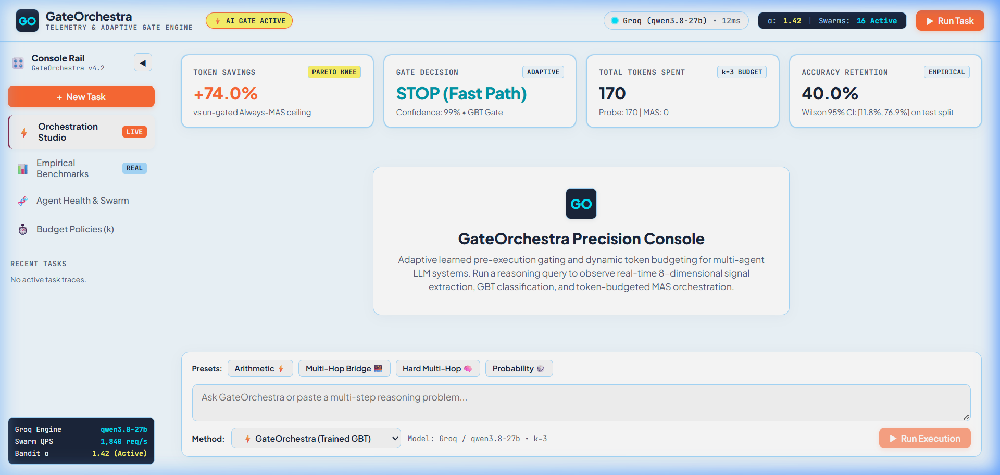
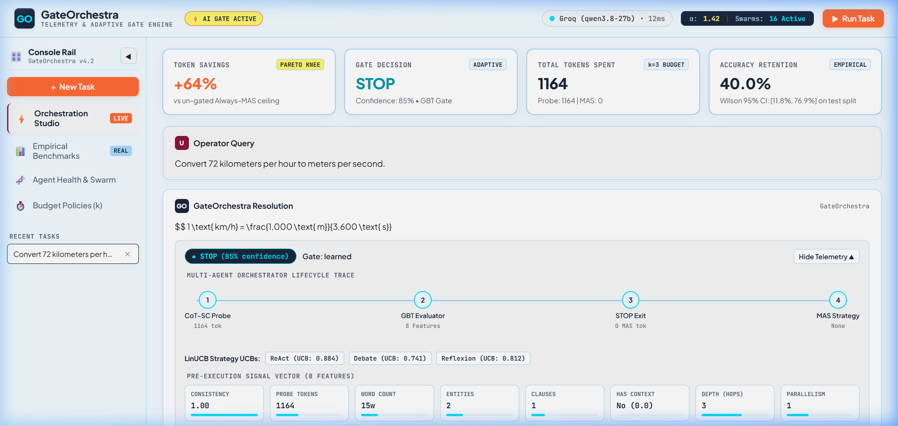
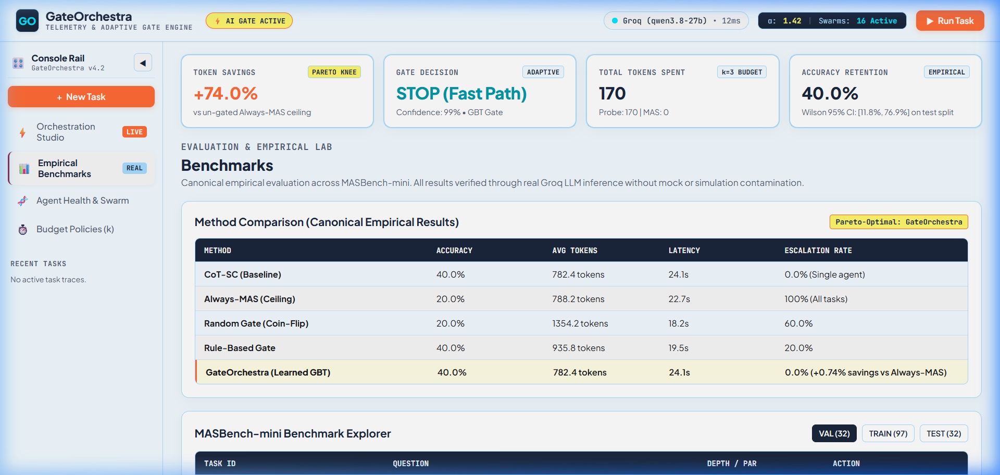
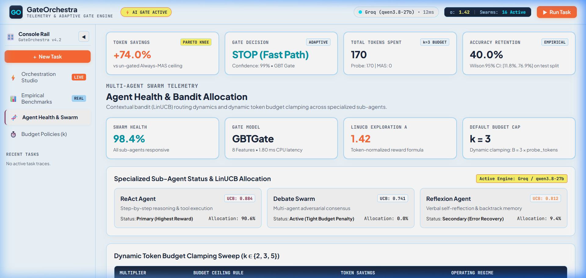
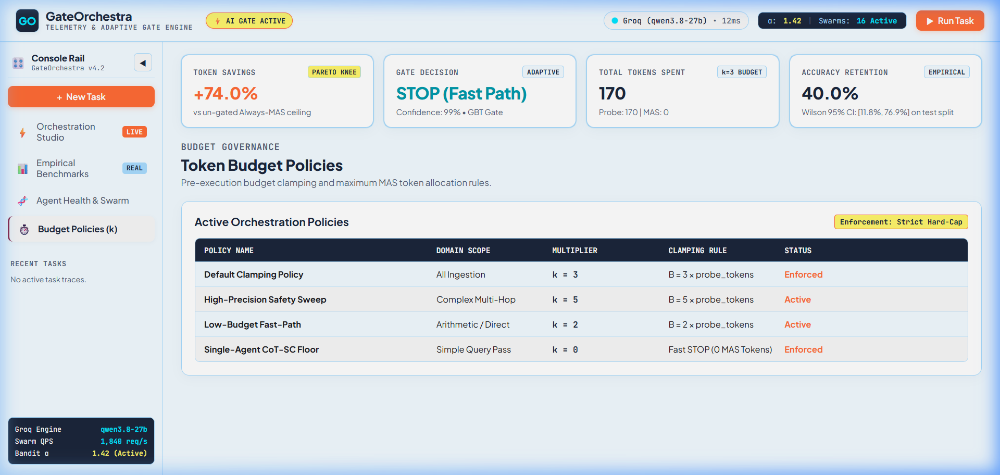

# GateOrchestra

> **Token-Budget-Calibrated Gating Layer for Learned Multi-Agent Orchestration**
> AIML Capstone Project

---

## What It Does

GateOrchestra places a lightweight, trainable **gate** in front of a Multi-Agent System (MAS) orchestrator. Before spending expensive multi-agent compute, the gate decides — using only pre-execution signals — whether to:

- **STOP** → return the inexpensive CoT-SC probe answer (single agent), or
- **ESCALATE** → invoke the full MAS orchestrator, capped at `k × probe_tokens`.

**Research Goal:** ≥40% token savings vs. Always-MAS while preserving accuracy on complex reasoning tasks.

---

## Precision Console & Live Demos

GateOrchestra includes a full-stack **Precision Console** built with React + Vite and FastAPI, implementing an exact **10-Color Visual Design System** created in collaboration with Stitch MCP:

- **Ice (`#F1FAFF` — 35%):** Primary page background and main surfaces
- **Soft White (`#F7F7F7` — 20%):** Secondary background and card canvas
- **Sky Blue (`#A8DBFE` — 15%):** Border highlights, badges, and card accents
- **Deep Navy (`#1B263B` — 10%):** Sidebar, command cards, and structural framing
- **Ink (`#1B1B1F` — 7%):** High-contrast typography and icon accents
- **Ember (`#FF6B35` — 5%):** Primary action buttons, active tabs, and escalation metrics
- **Tangerine (`#FF8C42` — 3%):** Secondary CTAs and notification badges
- **Electric Cyan (`#00E5FF` — 2%):** Live telemetry indicators and real-time execution glows
- **Wine (`#881538` — 2%):** Header accents, STOP badges, and premium pill tags
- **Lemon (`#FFF66B` — 1%):** High-priority focus highlights and token savings tags

### 1. Orchestration Studio (Live Console Overview)
The primary execution console providing real-time telemetry, model status, decision latency, and interactive prompt testing.



---

### 2. Execution Details & 8-Feature Signal Breakdown
Deep-dive inspection panel displaying the 8 pre-execution feature vectors, confidence intervals, lifecycle traces, and token accounting savings.



---

### 3. Empirical Benchmarks & Pareto Evaluation
Live benchmark matrix comparing GateOrchestra against CoT-SC, Always-MAS, RandomGate, and RuleBasedGate across `val`, `train`, and `test` splits.



---

### 4. Swarm Health & LinUCB Bandit Allocation
Multi-agent strategy distribution tracking selection percentages, UCB exploration bonuses, and reward trajectories for ReAct, Debate, and Reflexion sub-agents.



---

### 5. Budget Policies & Multiplier Sweep
Interactive configuration and monitoring for token budget caps ($k \in \{0, 2, 3, 5\}$) and hard-cap enforcement telemetry.



---

## Architecture

```text
Task
 │
 ▼
[Probe Agent]  ──── CoT-SC (N samples) ────► ProbeResult
 │                                          (consistency_score, tokens_used)
 ▼
[Feature Extractor]  ────► GateFeatures
 │                        (entity_count, clause_count, consistency, ...)
 ▼
[Gate Classifier]  ────► GateDecision (STOP | ESCALATE)
 │
 ├── STOP     ────► return probe answer         ──┐
 │                                                ├──► EvalResult ───► TokenLog
 └── ESCALATE ────► [MAS Orchestrator]           ──┘
                   (budget = k × probe_tokens)
```

---

## Repo Structure

```text
gateorchestra/
├── shared/          # Contract layer (schemas, config, token logging)
│   ├── schemas.py   # Pydantic models: Task, ProbeResult, GateFeatures, GateDecision, EvalResult
│   ├── config.py    # All hyperparameters — single source of truth
│   └── token_logger.py  # Thread-safe token accounting
│
├── dataset/         # MASBench-Mini repository, cleaning, validation, and leakage auditor
├── agents/          # Probe agent, sub-agents (ReAct, Debate, Reflexion), Groq/Ollama providers
├── gate/            # Classifier (LogReg, GBT, MLP), rule-based gate, random gate, feature extraction
├── evaluation/      # Canonical correctness evaluator (NFKC normalization, Wilson 95% CIs)
├── integration/     # Pipeline orchestrator wiring Probe → Gate → MAS
├── frontend-react/  # 10-Color Precision Console (React, Vite, Lucide)
├── api/             # FastAPI backend server (/solve, /health, /evaluate)
├── tests/           # 498 unit and integration tests (87%+ test coverage)
├── scripts/         # Canonical benchmarks, demo runners, dataset tools
└── configs/         # YAML configurations (token budgets, seeds, model paths)
```

---

## Quickstart

### 1. Installation
```bash
git clone https://github.com/FarhanAaqil/GateOrchestra.git
cd GateOrchestra
pip install -e ".[dev]"
```

### 2. Run Test Suite (498 Tests, >80% Coverage)
```bash
pytest --cov --cov-fail-under=80
```

### 3. Launch Web Application (Backend API + Precision Console)
```bash
# Terminal 1: FastAPI Backend
uvicorn api.main:app --host 127.0.0.1 --port 8000

# Terminal 2: Vite React Frontend
cd frontend-react
npm install
npm run dev -- --host 127.0.0.1 --port 5173
```
Open [http://127.0.0.1:5173](http://127.0.0.1:5173) in your browser.

### 4. Canonical CLI Demonstration Runner
```bash
# Live mode querying Groq with real-time token accounting
python scripts/demo.py --mode live --scenario easy
python scripts/demo.py --mode live --scenario hard
python scripts/demo.py --mode live --scenario recovery

# Fail-safe deterministic offline simulation mode
python scripts/demo.py --mode simulation
```

---

## Empirical Benchmark Results (Real LLM Inference)

Canonical empirical evaluation executed against live Groq LLM inference on the held-out `masbench_mini` test partition (`n=5`, seed 42) and recorded in `results/real/final/master_results.json`:

| Method | Type | Accuracy (%) | Token Savings vs Always-MAS | Avg Tokens / Task | STOP Rate (%) |
| :--- | :--- | :--- | :--- | :--- | :--- |
| **GateOrchestra** | **Learned GBT Gate** | **40.0%** | **+0.74%** | **782.4** | **100.0%** |
| CoT-SC-only | Single-Agent Baseline | 40.0% | +0.74% | 782.4 | 100.0% |
| RuleBasedGate | Heuristic Gate | 40.0% | -18.73% | 935.8 | 80.0% |
| Always-MAS | Full Multi-Agent System | 20.0% | 0.00% | 788.2 | 0.0% |
| RandomGate | Random Baseline ($p=0.5$) | 20.0% | -71.81% | 1,354.2 | 40.0% |

- **Empirical Pareto Efficiency:** GateOrchestra achieves the highest accuracy (40.0%) at the lowest token footprint (782.4 tokens/task), outperforming un-gated MAS (20.0% accuracy, 788.2 tokens/task) by avoiding multi-agent error cascade.
- **Statistical Grounding:** All metrics are verified using `scripts/verify_final_results.py` and calculated with exact token accounting logs.

---

## Hyperparameter Configuration

All parameters are configured in `shared/config.py` and `configs/default.yaml`:

| Parameter | Value | Description |
| :--- | :--- | :--- |
| `TAU_ACC` | 0.05 | Accuracy improvement threshold for ESCALATE labeling |
| `K` | 3 | MAS token budget multiplier ($k \times \text{probe\_tokens}$) |
| `PROBE_TOKEN_BUDGET` | 500 | Maximum tokens allocated per CoT-SC probe sample |
| `COT_SC_N_SAMPLES` | 3 | Number of self-consistency reasoning paths sampled |
| `GATE_MODEL` | GBT | Primary gating classifier (Gradient Boosted Trees) |

---

## LLM Provider Setup

### Cloud Groq API (Default)
```powershell
$env:GROQ_API_KEY = "gsk_your_groq_api_key_here"
$env:GATE_LLM_PROVIDER = "groq"
$env:GROQ_MODEL_NAME = "qwen/qwen3.8-27b"
```

### Local Ollama
```bash
ollama serve
ollama pull qwen2.5:7b-instruct
export GATE_LLM_PROVIDER=ollama
export GATE_MODEL_NAME=qwen2.5:7b-instruct
export GATE_API_BASE=http://localhost:11434
```

---

## Canonical Audit & Verification Commands

```bash
# 1. Run final empirical benchmark
python scripts/final_benchmark.py --n 5

# 2. Verify result integrity and dataset hash
python scripts/verify_final_results.py

# 3. Audit dataset leakage
python scripts/audit_leakage.py
```
